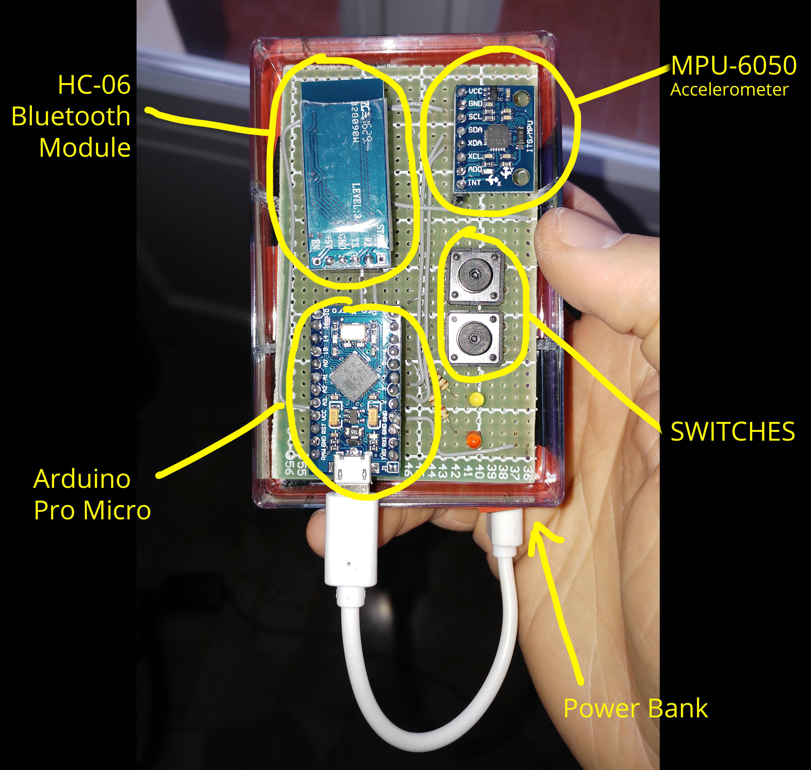

# gesture-keyboard
Gesture keyboard is a library used to convert accelerometer data to a sequence of characters and sentences.

To see what this library is capable of, check out the video below.
If you want to implement or customize this yourself, check out the tutorial below.

## Demostration Video
[Click here to watch the demonstration video](https://www.youtube.com/watch?v=OjTNS2ZKqRc)

## Module

In order to get the accelerometer data, I build a module using an Arduino, a MPU-6050 as accelerometer and a HC-06 to enable bluetooth comunication. The entire module gets powered by using a power bank.



When someone press the first button, the module starts to send accelerometer data to the pc.
When the button is relased, the transmission stops.

## Library

The library it's written in Python and uses Scikit-learn's SVM (Support Vector Machine) algorithm to classify the signals into letters.

### On Windows
If you are using windows, the easiest way to download the needed libraries is to [download the Python(X,Y) distribution here.](https://python-xy.github.io/)

## How to Use the Library

These are the basic steps needed to implement this library and to customize it.

### Arduino

Any Arduino will work for this project, you will also need an MPU-6050 accelerometer and a button.

You can get the Arduino Sketch in the Arduino folder inside the project. You will probaby need to make a few changes to make it work.

**NOTE:** If you don't want to use a Bluetooth module with this project, check out the BASIC version of the Sketch in the Arduino folder.

After flashing the sketch to the Arduino, make sure that everything works correctly:
* Open the Serial Monitor in the Arduino IDE
* Set the baudrate to 38400
* Press the button on the Arduino for a short time, you should see an output like this:
```
STARTING BATCH
START -296 280 17140 -501 225 -1154 END
START 724 152 16228 -396 298 -176 END
START 372 16 16740 -346 219 -180 END
...
START 1096 1200 16644 -206 288 -2445 END
START 1632 1060 16104 -290 95 -3108 END
CLOSING BATCH
```

```
python learn.py
```

Then you can try writing:
```
python start.py port=<YOUR_SERIAL_PORT> write noautocorrect
```
